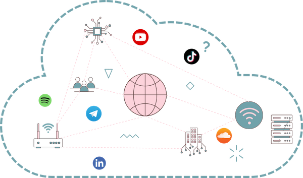
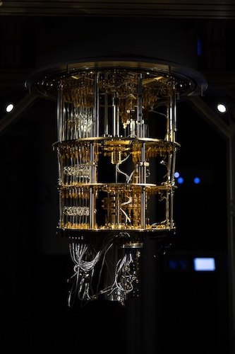
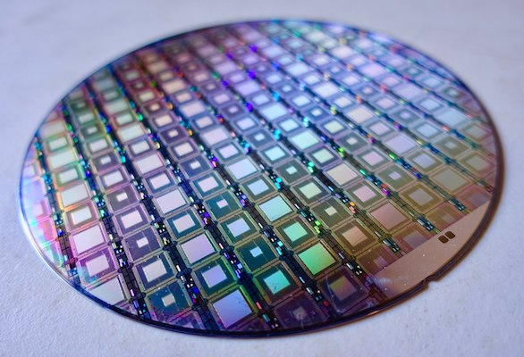
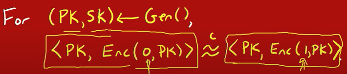

title: Post quantum cryoptography : achievement unlock with Kyber and Dilithium
class: animation-fade
layout: true

---

class: impact

# Post quantum cryptography
## Achievement unlocked with .red[{Kyber}] and .red[{Dilithium}]

By Willy Malvault

---

# And Internet came to life ...

.col-6[
* Public, federated, unpredictable and untrusted network

* Needs
  * Authentication
  * Confidentiality
]

.col-6[]

---

# Public Key Cryptography

.col-6[
  ## Public key encryption
  <!-- Set of 3 probabilistic algorithms -->
  ```
  pk,sk := KeyGen()
  c := Enc(pk, m)
  m := Dec(sk, m)
  ```

  `pk` is published

  `sk` is kept secret

  Anyone knowing `pk` can crypt messages that only `sk` holder would be able to decrypt.
]

--

.col-6[
  ## Digital signature scheme
  <!-- Set of 3 probabilistic algorithms -->
  ```
  pk,sk := KeyGen()
  s := Sign(sk, m)
  v := Verify(pk, m, v)
  ```

  Only `sk` holder can sign a message

  Anyone knowing `pk`, `m` and `s` can verify the signature
]
---

# RSA (legacy) cryptosystem

.col-6[

#### Rivest-Shamir-Adelman (RSA) 1977
]

.col-6[
* Provably secure according to **prime numbers factorization difficulty**

* Provides
    * Public key encryption
    * Digital signature

* Slow on encryption and decryption --> session key establishment, typically with Diffie-Helman key exchange
]

---

# RSA in short

---

# Quantum Computer
.col-6[
* lalala

* lalalala
]

.col-6[
  
  #### IQM Quantum Computer Espoo Finland
]

---

# Quantum Computer in 2022
.col-6[
* lalala

* lalalala
]

.col-6[
  
  #### Wafer of D-wave quantum computers
]
---

# Todolist
* how about ECDCA, elliptic curve and PQC ?

---

class: impact, center, middle

# BREAK
---

# Display and Inline Math formulae

1. This is an inline integral: `\(\int_a^bf(x)dx\)`
2. More `\(x={a \over b}\)` formulae.

Display formula:

$$e^{i\pi} + 1 = 0$$

---

class: full, center

# Post Quantum Cryptography (PQC)

## What's the problem ?

.col-4[
  ## Asymetric cryptography

  * crypt Internet traffic (TLS, SSH, etc.)
  * sign content (software binaries, etc.)
]

--
.col-4[
  ## Quantum Computing

  * crypt Internet traffic (TLS, SSH, etc.)
  * sign content (software binaries, etc.)
]

--

.col-4[
  ## [Shor's algorithm](https://fr.wikipedia.org/wiki/Algorithme_de_Shor)
  Breaks legacy cryptography using quantum computing
]

---
# Math testing
`\( \phi(x) = \frac{1}{\sqrt{2 \pi}} e^{-\frac{x^2}{2}} \)` and its CDF,

`\[
\Phi(x) = \frac{1}{\sqrt{2 \pi}} \int_{-\infty}^x e^{-\frac{s^2}{2}}ds
\]`

---

class: full

# The post quantum problem

--

## Shor algorithm threat

[Shor Algorithm](https://fr.wikipedia.org/wiki/Algorithme_de_Shor)

--

## Post quantum
* [NIST standarization CFP](https://csrc.nist.gov/Projects/post-quantum-cryptography/post-quantum-cryptography-standardization)
* [NIST Announcement](https://www.nist.gov/news-events/news/2022/07/nist-announces-first-four-quantum-resistant-cryptographic-algorithms)

---
# Kyber - resources

## IND-CCA2 secure Key Encapsulation Mechanism (aka KEM)
* indistinguishability under adaptive chosen ciphertext attack
* higher class of "no information on input (text, key) can be retrieved from ciphertext".

## Based on the hardness of solving the learning-with-errors (LWE) problem over module lattices

---
# Kyber - Key generation

```golang
rho, sig := {0, 1}256
A := Sam(Rk, rho)
s,e := 
```

---

class: full, center

# From classic hard to quantum hard

.col-6[
  ## classic hard problems

  * integer factorization
  * discrete logarithm
]

--
.col-6[
  ## Quantum hard problems

  * algebric lattice
  * provably secure against worst-case instance of lattive problems
]

---
# Learning with errors - 1

## From one bit security to IND-CPA secure PKS Theorem

---
# Learning with errors - 2

> Oded Regev. On lattices, learning with errors, random linear codes, and cryptography. pages 84–93, 2005.

The LWE assumption states that it is hard to distinguish
from uniform the distribution (A, As + e), where A is a uniformly-random matrix in Zm×n, s is a uniformly-random
vector in Zq , and e is a vector with random “small” coefficients chosen from some distribution

---
# Dilithium

[Dilithium](https://pq-crystals.org/dilithium/index.shtml)

---

# Resources

* [Stephan Borzmeyer article](https://www.bortzmeyer.org/nist-pq.html)

---

# Kyber - resources - IND-CCA2

## The Key Encapsulation Mechanism problem (aka KEM)
* Generating a symetric private key for a given session, based on asymetric cryptography.

## [Kyber](https://pq-crystals.org/kyber/index.shtml)
* Is an [IND-CCA2 secure](https://en.wikipedia.org/wiki/Ciphertext_indistinguishability) KEM (Key Encapsulation Mechanism) protocol
    * IND-CCA = Indistinguishability under chosen-plaintext attack
    * 2 = [Adaptive chosen ciphertext attack](https://en.wikipedia.org/wiki/Adaptive_chosen-ciphertext_attack)

---
# Kyber - resources - LWE on module lattice

## Learning With Errors (LWE)
The design of Kyber has its roots in the seminal LWE-based encryption scheme of Regev. Since Regev's original work, the practical efficiency of LWE encryption schemes has been improved by observing that the secret in LWE can come from the same distribution as the noise and also noticing that "LWE-like" schemes can be built by using a square (rather than a rectangular) matrix as the public key. Another improvement was applying an idea originally used in the NTRU cryptosystem to define the Ring-LWE and Module-LWE problems that used polynomial rings rather than integers. The CCA-secure KEM Kyber is built on top of a CPA-secure cryptosystem that is based on the hardness of Module-LWE.

## module lattice

## Resources
* [Kyber source code](https://github.com/pq-crystals/kyber)
---

# Resources
* [Réseaux euclidiens](https://www.youtube.com/watch?v=G23kfRJGH0k)
* [Learning with Error explanation video](https://www.youtube.com/watch?v=QcVns57MTxg)
* [LWE and lattices explained](https://www.youtube.com/watch?v=6qD-T1gjtKw)
* [Course on SIS and LWE](https://www.youtube.com/watch?v=K_fNK04yG4o)
* [Course on ring LWE](https://www.youtube.com/watch?v=Lo-_ZBqGa7I)

---

# Remark pure resources

## 12-column grid layout

Use to the included **grid layout** classes to split content easily:
.col-6[
  ### Left column

  - I'm on the left
  - It's neat!
]
.col-6[
  ### Right column

  - I'm on the right
  - I love it!
]

## Learn the tricks

See the [wiki](https://github.com/gnab/remark/wiki) to learn more of what you can do with .alt[Remark.js]
