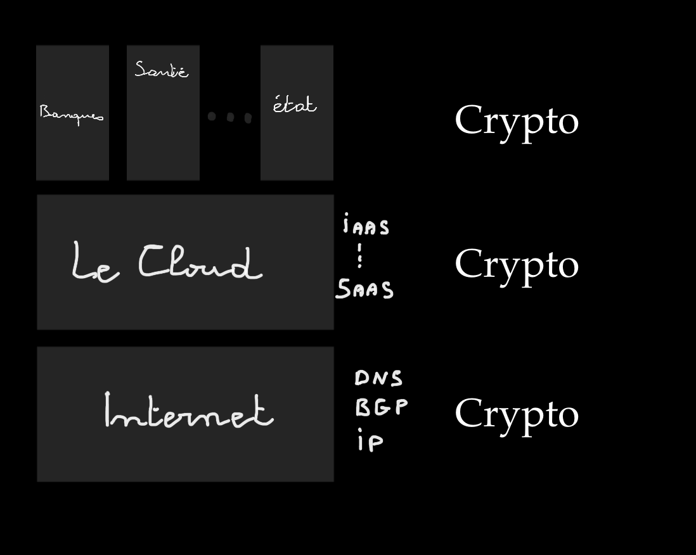
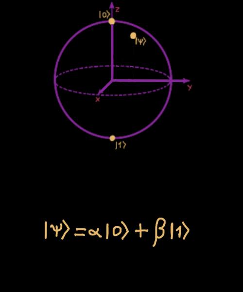
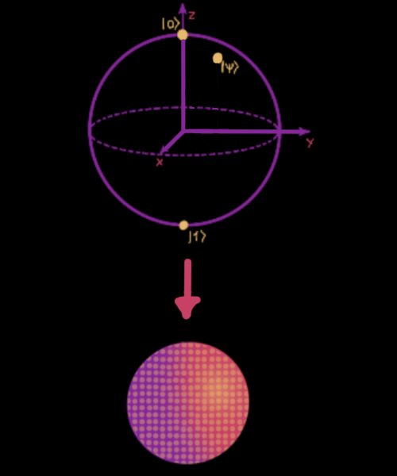
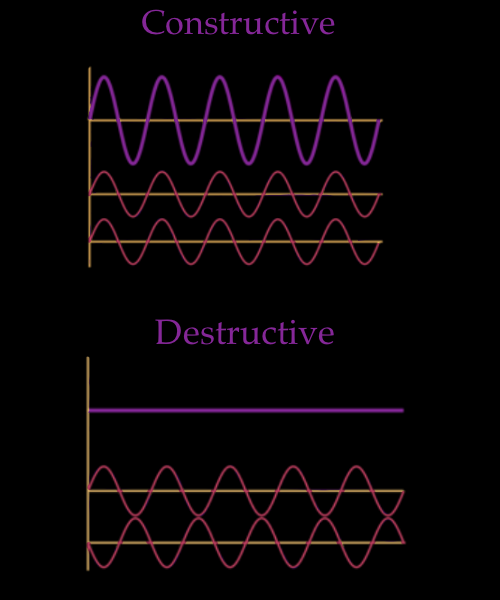
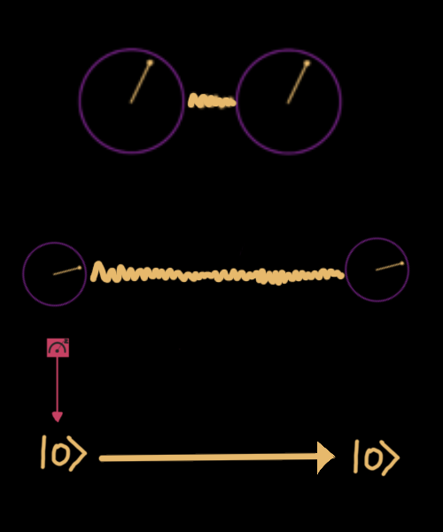

title: Post quantum cryoptography, the future of Internet
class: animation-fade
layout: true

---

class: impact
background-image: url(./images/home.png)

# Post Quantum Cryptography, future of the Internet

## Willy Malvault - Snowcamp 2023

---
# On Wednesday 6 of July 2022
.center[]

---
# What is a public key cryptography scheme ?

--


---

# What is a public key cryptography scheme ?

---

# What is a public key cryptography scheme ?

---

# What is a public key cryptography scheme ?

---

# What is a public key cryptography scheme ?


---
#  Where is it used ?



---
# How to implement public key cryptography ?

.col-6[

> Ronald L. Rivest, Adi Shamir, Leonard M. Adleman: A Method for Obtaining Digital Signatures and Public-Key Cryptosystems. Commun. ACM 21(2): 120-126 (1978)
]

--

.col-6[
### RSA cryptosystem
* Provably secure according to .red[**prime numbers factorization**] difficulty

* Provides
    * Public key encryption
    * Digital signature

* Have brothers and sisters: DSA, ECDSA, etc..
]

---
### Prime number factorization


---
### Prime number factorization


---
### Prime number factorization


---
### Prime number factorization


---
# RSA cryptosystem

.col-4[
  KeyGen()
  ```
  n = p * q

  e = ctf(p,q)

  ```

  > e is coprime to Charmichael totient function of n

  ```
  pk = (e, n)

  sk = (mmi(e), n)
  ```

  > mmi is modular multiplicative inverse function
]

--

.col-4[
  Enc(pk, m)

  `\(c = m^{e}\ mod\ n\)`

  Dec(sk, c)

  `\(m = c^{sk}\ mod\ n\)`
]

--

.col-4[
  Sign(sk, m)

  `\(s = hash(m)^{sk}\ mod\ n\)`

  Verify(pk, m)

  `\(h = s^{e}\ mod\ n\)`

  OK if `\(hash(m)=h\)`
]

---
# RSA and Co are working great !

.col-6[
### Formalized RSA problem
  If an attacker can retrieve `p` and `q` from `n`, then she can retrieve `e` and `sk`

### Difficulty
  It takes around 1000 core-years to factorize RSA-768 (record), with a classical computer.

> Fabrice Boudot, Pierrick Gaudry, Aurore Guillevic, Nadia Heninger, Emmanuel Thomé, Paul Zimmermann: Comparing the difficulty of factorization and discrete logarithm: a 240-digit experiment. IACR Cryptol. ePrint Arch. 2020: 697 (2020)
]

.col-6[
### NIST standardization
> Blablabla

[rsa nist standardization](https://csrc.nist.gov/glossary/term/RSA)

]

---
class: impact, center, middle

# But... this stands only for classical computers

---

.col-6[

]

.col-6[
## Qubit
* Is the unit of quantum information
* With quantum properties
    * Superposition of basis states `\( | 0 \rangle \)` and `\( | 1 \rangle \)`
    * Quantum entanglement
    * **Cannot be copied**
* And non quantum properties too
    * Can be measured to `1` or `0`
]

---

.col-6[

]

.col-6[
## Superposition
* A Qubit state is `\( | \psi \rangle\ =\ \alpha | 0 \rangle \ +\ \beta | 1 \rangle \)`
* `\( \alpha \)` and `\( \beta \)` are the probability amplitude of the qubit to be in the basic states `\( | 0 \rangle \)` or `\( | 1 \rangle \)`
* **The Qubit is said to be in all states at once**
* And... `\( \alpha \)` and `\( \beta \)` can have interferences ...
]

---
.col-6[

]

## Phase interference
* `\( \alpha \)` and `\( \beta \)` can have constructive interference
* `\( \alpha \)` and `\( \beta \)` can have destructive interference
* Interferences can produce a deterministic qubit state

---

.col-6[

]

.col-6[
## Measurement
* Once measured, a qubit is in a deterministic state `\( | 0 \rangle \)` or `\( | 1 \rangle \)`
* Measurement disrupts the qubit states
    * Rules are needed to determinate the state of a qubit
    * Error correction are needed !

Note: Errors management without copy is hell !
]

---

.col-6[

]

.col-6[
## Entanglement
* Only two qubit can be entangled
    * No sharing
    * No more thant 2 qubits
* Entanglement is preserved according to time and space
* Measuring the state of an entangled qubit allows to determinate the state of the other qubit
* There is neither teleportation nor time travel her !
]

---
.col-6[.center[.pad-top-150[
# Why is the qubit so powerfull ?
]]]

--

.col-6[

]

---
# Things Quantum Computing is good at

.col-6[
### Nuclear
### Pharma
### Combinatory
]

.col-6[
### Articficial intelligence
### Breaking RSA !
]

---
.col-6[
# Shor algorithm
]

.col-6[

]

---
.col-5[
### Should we be afraid yet ?

]

--

.col-7[

]

---
class: center


---
# The solutions to Quantum Threat

## Quantum Cryptography
Using quantum channels to exchange private keys.

> C. H. Bennett and G. Brassard. "Quantum cryptography: Public key distribution and coin tossing". In Proceedings of IEEE International Conference on Computers, Systems and Signal Processing, volume 175, page 8. New York, 1984

--

## Post-quantum Cryptography
Use traditionnal computers to use cryptography schemes robust to quatume attacks.

---
class: center

## NIST PQC challenge


---
# Selected protocols
### Public Key encryption and key-establishment
[Kyber](https://pq-crystals.org/): an IND-CCA2-secure key-encapsulation mechanism (KEM)

### Digital signature
[Dilithium](https://pq-crystals.org/): a strongly EUF-CMA-secure digital signature algorithm

[Falcon](https://falcon-sign.info/): Fast-Fourier lattice-based compact signatures over NTRU

[SPHINCS+](https://sphincs.org/): is a stateless hash-based signature scheme.

---
.col-6[
## Introduction to lattice
### Definition

* Infinite set of points in some N dimensional space
]

.col-6[

]

---
.col-6[
## Introduction to lattice
### Definition
* Infinite set of points in some N dimensional space
* Linear combination of vectors from a basis `\({b_1, b_2, ...b_N}\)` of `\(\mathbb{R}^N\)`
* `\( L= \left\{ \sum a_{i} {b} _{i}\ :\ a_{i}\in \mathbb {Z} \right\} \)`
]

.col-6[

]

---
.col-6[
## Introduction to lattice
### Definition
* Infinite set of points in some N dimensional space
* Linear combination of vectors from a basis `\({b_1, b_2, ...b_N}\)` of `\(\mathbb{R}^N\)`
* `\( L= \left\{ \sum a_{i} {b} _{i}\ :\ a_{i}\in \mathbb {Z} \right\} \)`

### fundamental hard problem
* Closest Vector Problem (CVP)
* Shortest Vector Problem (SVP)
]

.col-6[

]

---
.col-6[
## Lattice based encryption
### Encrypt
* Good basis `\((b_1, b_2)\)` is the private key
* Bad basis `\((b_1', b_2')\)` is the public key
* Encode bit with coordinates of a lattice point (according to public key, by instance)
]

.col-6[

]

---
.col-6[
## Lattice based encryption
### Encrypt
* Good basis `\((b_1, b_2)\)` is the private key
* Bad basis `\((b_1', b_2')\)` is the public key
* Encode bit with coordinates of a lattice point (according to public key, by instance)

### Encrypt
* Try to surround the point
]


.col-6[

]

---
.col-6[
## Lattice based encryption
### Encrypt
* Good basis `\((b_1, b_2)\)` is the private key
* Bad basis `\((b_1', b_2')\)` is the public key
* Encode bit with coordinates of a lattice point (according to public key, by instance)

### Encrypt
* Try to surround the point
* Easy to find with good basis
]


.col-6[

]

---
.col-6[
## Lattice based encryption
### Encrypt
* Good basis `\((b_1, b_2)\)` is the private key
* Bad basis `\((b_1', b_2')\)` is the public key
* Encode bit with coordinates of a lattice point (according to public key, by instance)

### Encrypt
* Try to surround the point
* Easy to find with good basis
* Hard to find with bad basis (or no basis)
]


.col-6[

]

---
.col-6[
## Lattice based digital signature
### Principle
* Encode document with point in space
* Closest Vector is the signature
]


.col-6[

]

---
.col-6[
## Lattice based digital signature
### Principle
* Encode document with point in space
* Closest Vector is the signature

### Disadvantages
* Informations about private key can leak with a great number of signatures.
]


.col-6[

]

---

# Kyber in analytics version

[Better video on Kyber/Lattices](https://www.youtube.com/watch?v=FUb75AUXMvw)

---

# Resources

### Quantum Computing
* [IBM Composer Guide](https://quantum-computing.ibm.com/composer/docs/iqx/guide/)

### Post quantum Cryptography
* [Article de Stéphane Bortzmeyer sur l'annonce su NIST](https://www.bortzmeyer.org/nist-pq.html)
* [NIST PQC standardization page](https://csrc.nist.gov/Projects/post-quantum-cryptography/post-quantum-cryptography-standardization)
* [McKinsey - when-and-how-to-prepare-for-post-quantum-cryptography](https://www.mckinsey.com/capabilities/mckinsey-digital/our-insights/when-and-how-to-prepare-for-post-quantum-cryptography)

## Lattice based encryption explained
[video on lattice based crypto](https://www.youtube.com/watch?v=832mo7IVJug)
[Better video on Kyber/Lattices](https://www.youtube.com/watch?v=FUb75AUXMvw)

---

# Factorizing 15
.col-6[
* lalala

* [IBM research blog](https://research.ibm.com/blog/factor-15-shors-algorithm)
]

.col-6[
  
]

---
class: impact, center, middle

# BREAK

---

# Todolist
* how about ECDCA, elliptic curve and PQC ?

---

# Display and Inline Math formulae

1. This is an inline integral: `\(\int_a^bf(x)dx\)`
2. More `\(x={a \over b}\)` formulae.

Display formula:

$$e^{i\pi} + 1 = 0$$

---

class: full

# The post quantum problem

--

## Shor algorithm threat

[Shor Algorithm](https://fr.wikipedia.org/wiki/Algorithme_de_Shor)

--

## Post quantum
* [NIST standarization CFP](https://csrc.nist.gov/Projects/post-quantum-cryptography/post-quantum-cryptography-standardization)
* [NIST Announcement](https://www.nist.gov/news-events/news/2022/07/nist-announces-first-four-quantum-resistant-cryptographic-algorithms)

---
# Kyber - resources

## IND-CCA2 secure Key Encapsulation Mechanism (aka KEM)
* indistinguishability under adaptive chosen ciphertext attack
* higher class of "no information on input (text, key) can be retrieved from ciphertext".

## Based on the hardness of solving the learning-with-errors (LWE) problem over module lattices

---
# Kyber - Key generation

```golang
rho, sig := {0, 1}256
A := Sam(Rk, rho)
s,e := 
```

---

class: full, center

# From classic hard to quantum hard

.col-6[
  ## classic hard problems

  * integer factorization
  * discrete logarithm
]

--
.col-6[
  ## Quantum hard problems

  * algebric lattice
  * provably secure against worst-case instance of lattive problems
]

---
# Learning with errors - 1

## From one bit security to IND-CPA secure PKS Theorem

---
# Learning with errors - 2

> Oded Regev. On lattices, learning with errors, random linear codes, and cryptography. pages 84–93, 2005.

The LWE assumption states that it is hard to distinguish
from uniform the distribution (A, As + e), where A is a uniformly-random matrix in Zm×n, s is a uniformly-random
vector in Zq , and e is a vector with random “small” coefficients chosen from some distribution

---
# Dilithium

[Dilithium](https://pq-crystals.org/dilithium/index.shtml)

---

# Resources

* [Stephan Borzmeyer article](https://www.bortzmeyer.org/nist-pq.html)

---

# Kyber - resources - IND-CCA2

## The Key Encapsulation Mechanism problem (aka KEM)
* Generating a symetric private key for a given session, based on asymetric cryptography.

## [Kyber](https://pq-crystals.org/kyber/index.shtml)
* Is an [IND-CCA2 secure](https://en.wikipedia.org/wiki/Ciphertext_indistinguishability) KEM (Key Encapsulation Mechanism) protocol
    * IND-CCA = Indistinguishability under chosen-plaintext attack
    * 2 = [Adaptive chosen ciphertext attack](https://en.wikipedia.org/wiki/Adaptive_chosen-ciphertext_attack)

---
# Kyber - resources - LWE on module lattice

## Learning With Errors (LWE)
The design of Kyber has its roots in the seminal LWE-based encryption scheme of Regev. Since Regev's original work, the practical efficiency of LWE encryption schemes has been improved by observing that the secret in LWE can come from the same distribution as the noise and also noticing that "LWE-like" schemes can be built by using a square (rather than a rectangular) matrix as the public key. Another improvement was applying an idea originally used in the NTRU cryptosystem to define the Ring-LWE and Module-LWE problems that used polynomial rings rather than integers. The CCA-secure KEM Kyber is built on top of a CPA-secure cryptosystem that is based on the hardness of Module-LWE.

## Resources
* [Kyber source code](https://github.com/pq-crystals/kyber)
---

# Resources
* [Réseaux euclidiens](https://www.youtube.com/watch?v=G23kfRJGH0k)
* [Learning with Error explanation video](https://www.youtube.com/watch?v=QcVns57MTxg)
* [LWE and lattices explained](https://www.youtube.com/watch?v=6qD-T1gjtKw)
* [Course on SIS and LWE](https://www.youtube.com/watch?v=K_fNK04yG4o)
* [Course on ring LWE](https://www.youtube.com/watch?v=Lo-_ZBqGa7I)

---

# Remark pure resources

## 12-column grid layout

Use to the included **grid layout** classes to split content easily:
.col-6[
  ### Left column

  - I'm on the left
  - It's neat!
]
.col-6[
  ### Right column

  - I'm on the right
  - I love it!
]

## Learn the tricks

See the [wiki](https://github.com/gnab/remark/wiki) to learn more of what you can do with .alt[Remark.js]
