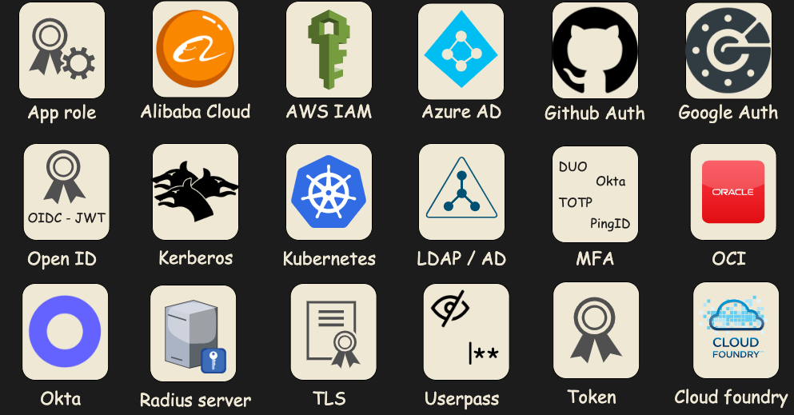

title: Recipes for Privacy
class: animation-fade
layout: true

.twitter-handle[
  @wmalvault
]

---

class: impact

# Security at scale recipes
## By Willy Malvault

---

# Key architectural concepts

---

## Secrets
It's all about secrets

---

## Dynamic credentials

---

## Encryption
### Keys management at scale

---

## Security as code

---
#Talking about Vault
* [Look at CNCF radars](https://radar.cncf.io/2021-09-devsecops)

---
# Vault authentication

---
#colorimetry
* .primary[primary]
* .secondary[secondary]
* .tertiary[tertiary]
* .light[light]
* .dark[dark]
* .text-light[text-light]
* .text-dark[text-dark]
* .code-background[code-background]

```golang
func main() {
  val := os.GetEnv('val')
}
```
